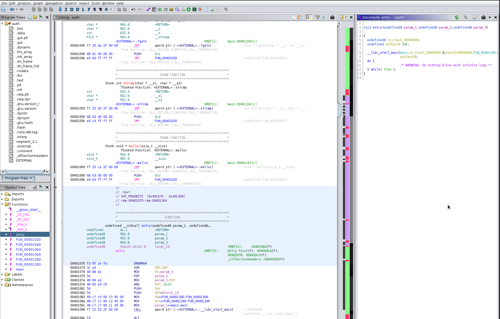
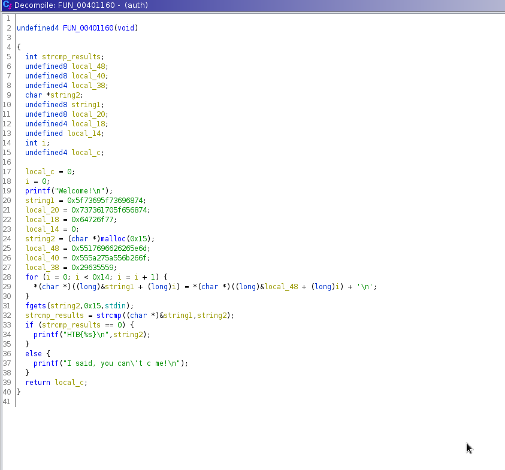
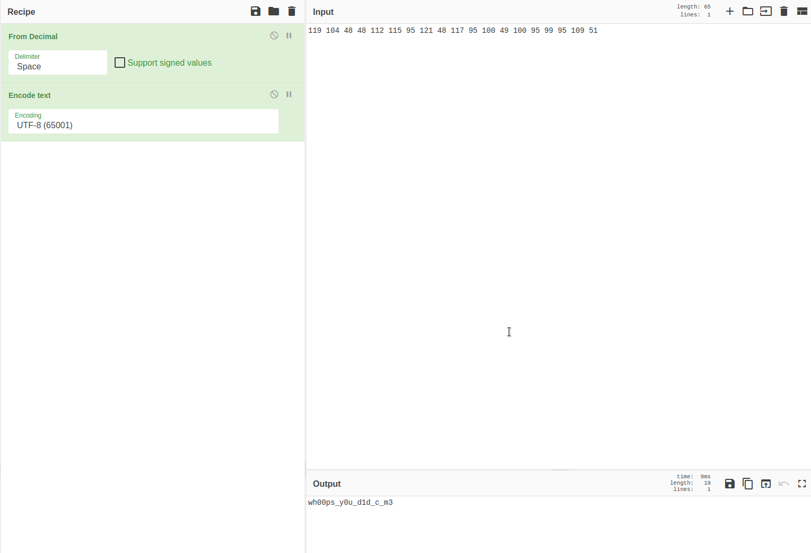
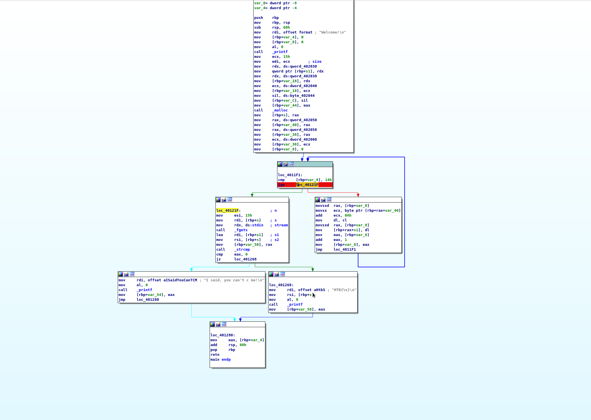
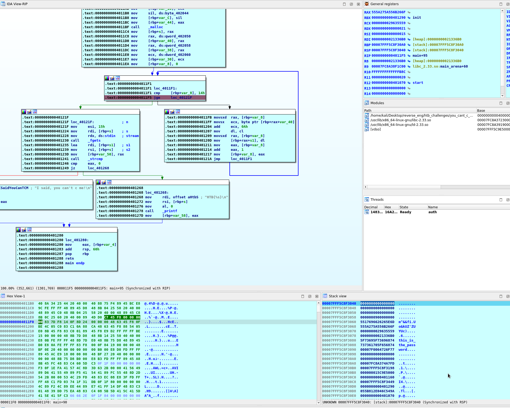
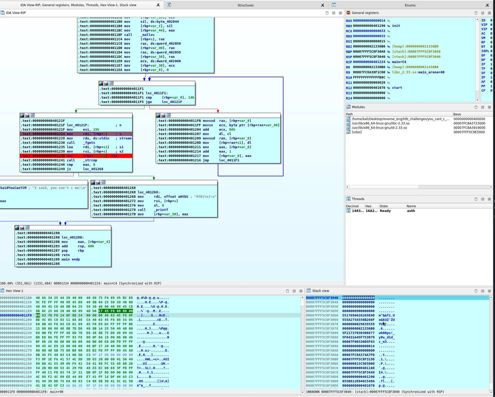
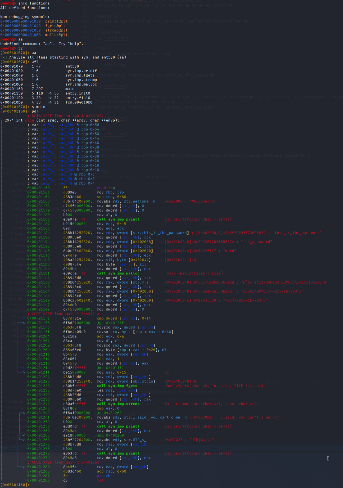
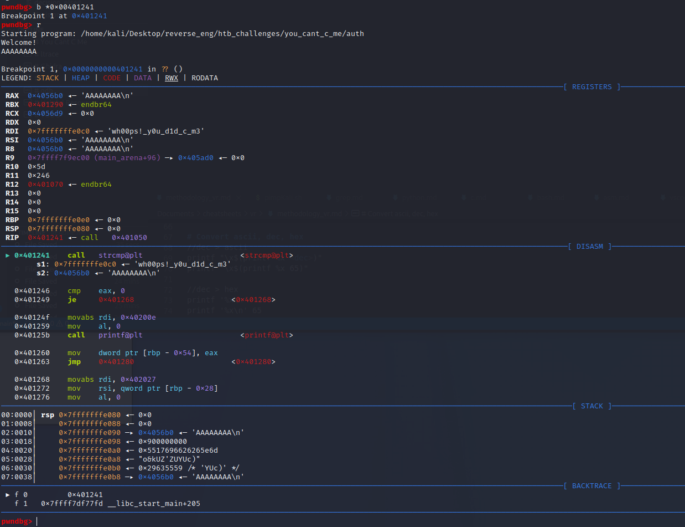

Raw notes

# You Cant C Me

## Key
```
└─# ./auth
Welcome!
wh00ps!_y0u_d1d_c_m3     
HTB{wh00ps!_y0u_d1d_c_m3}
```

# ltrace
```
//stripped
└─# file auth               
auth: ELF 64-bit LSB executable, x86-64, version 1 (SYSV), dynamically linked, interpreter /lib64/ld-linux-x86-64.so.2, for GNU/Linux 3.2.0, stripped

//ltrace finds strcmp("wh00ps!_y0u_d1d_c_m3")
└─# ltrace ./auth
printf("Welcome!\n"Welcome!
)                                                                                                                                                 = 9
malloc(21)                                                                                                                                                           = 0x15ca6b0
fgets(AAAA
"AAAA\n", 21, 0x7fc97dbf89a0)                                                                                                                                  = 0x15ca6b0
strcmp("wh00ps!_y0u_d1d_c_m3", "AAAA\n")                                                                                                                             = 54
printf("I said, you can't c me!\n"I said, you can't c me!
)                                                                                                                                  = 24
+++ exited (status 0) +++
```

# Ghidra
//Checked entry, renamed '__libc_start_main(FUN_00401160' into '__libc_start_main(main'


//cleaned up decompiled output


//line 29 is tough to decipher; string found in local_48
```
└─# echo "m^&&fiUo&kUZ'ZUYUc)" | ascii2dec.sh 
109 94 38 38 102 105 85 111 38 107 85 90 39 90 85 89 85 99 41  
```
//added 10  
119 104 48 48 112 115 95 121 48 117 95 100 49 100 95 99 95 109 51  

//cyberchef


# IDA
//set breakpoint before the loop



//stack shows [rbp+var_8] as 'this_is_the_password'



//Loop adds '\n' or decimal 10 to string in [rbp+var_40] and assigns it to [rbp+var_8], afterwards the password is shown  
//set breakpoint before the strcmp  
//stack shows [rbp+var_8] as 'wh00ps!_y0u_d1d_c_m3'  



# gdb
//used pwndbg
```
gdb-pwndbg ./auth
info functions          //binary is stripped
r2                      //start radare2
aa                      //analyze all
afl
s main                  //find main?
pdf                     //print disassembled function
```


//set breakpoint
b *0x00401241
r

//RSI shows the key



# Helpful Resources
https://r2wiki.readthedocs.io/en/latest/home/misc/cheatsheet/

# TODO
recreate the binary 'auth_mine.c'